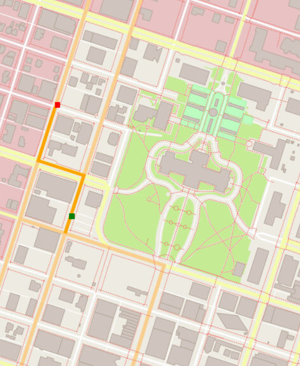

## Route planner using A* search



A* search selects a path between multiple nodes by finding a route with the smallest cost in distance travelled and time from a start to a finish node. For more on the algorithm, please see [here](https://en.wikipedia.org/wiki/A*_search_algorithm).

## Running on your local machine

This project runs best (easiest!) on Ubuntu. If you'd like to build on Mac or Windows, please e-mail me for guidance. 

On Linux, cd into the build directory and run:
```
cmake ..
make 
```

Once the build is complete, the executable files will be in the build folder. From the build directory, you can run the compiled executable with the OpenStreetMap data by entering the following command:

```
../bin/CppND-Route-Planning-Project -f ../map.osm
```


## Testing

For exercises that have unit tests, the project must be built with the approprate test cpp file. This can be done by using `cmake_tests` instead of `cmake`. For example, from the build directory:
```
cmake_tests ..
make
```
Those commands will build the code with the appropriate tests exercise. The tests can then be run from the `build` directory as follows:
```
../bin/test
```
Not all exercises have tests. The table is given below with the complete list of exercises with tests for reference:

| Exercise Name               | 
|-----------------------------|
| The RouteModel Class        |
| The Node Class              |
| Create RouteModel Nodes     |
| Write the Distance Function |
| Create Road to Node Hashmap |
| Write FindNeighbors         |
| Find the Closest Node       |
| Write the A* Search Stub    |
| Finish A* Search            |
